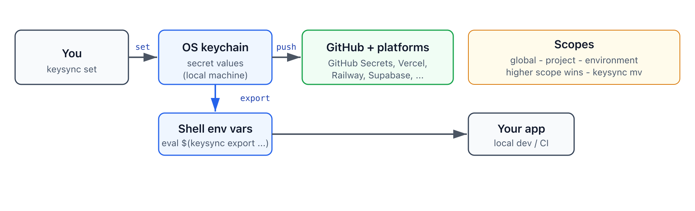

# keysync

[](https://github.com/dipockdas/keysync/stargazers)
[](https://github.com/dipockdas/keysync/network/members)
[](https://github.com/dipockdas/keysync/issues)
[](https://github.com/dipockdas/keysync/graphs/contributors)
[](https://github.com/dipockdas/keysync/commits/main)

[](https://github.com/dipockdas/keysync/releases)
[](https://github.com/dipockdas/keysync/actions/workflows/ci.yml)
[](https://github.com/dipockdas/keysync/actions/workflows/security.yml)
[](https://github.com/dipockdas/keysync/actions/workflows/codeql.yml)
[](https://scorecard.dev/viewer/?uri=github.com/dipockdas/keysync)
[](https://goreportcard.com/report/github.com/dipockdas/keysync)
[](https://github.com/dipockdas/keysync/actions/workflows/cross-platform.yml)
[](LICENSE)

**Stop checking secrets into git.** Keysync stores development secrets in your OS keychain (macOS Keychain, Linux libsecret, Windows Credential Manager) and syncs them to GitHub Secrets and deployment platforms with one command.

> **No keysync server. No keysync cloud.**  
> Secrets are stored in your OS keychain and never leave your machine unless you run `push` — which calls `gh` and your platform APIs directly OR `share` which will securely share keys with a team mate. You control exactly what gets sent, and when. If this project disappeared tomorrow, your keychain remains intact and all OS APIs keep working.

---

## Why keysync

`.env` files are convenient until they leak — committed by mistake, copied to the wrong machine, or shared in a screenshot. Your OS already has a credential store you trust for SSH keys and browser passwords. Keysync makes that store the source of truth for every development secret, with a single `keysync push` to GitHub and [any platform with a CLI or HTTP API](docs/platform-examples.md) — Vercel, Railway, Supabase, Cloudflare, GitLab, and more.

At runtime, apps read **environment variables** (from `keysync export` locally or from your platform in production). Client libraries check env first, so you are not locked in — migrate to Vault or AWS Secrets Manager later without rewriting application code.

Oh and it's just handy to get your secrets without having to remember where you left your keys....

[When is keysync the right fit?](docs/when-to-use.md) · [Architecture](docs/architecture.md) · [Security scanning](docs/SECURITY-SCANNING.md)

---

## Features

- OS-native secret storage (macOS, Linux, Windows)
- Global, project, and environment scopes with `keysync mv` between them
- `keysync push` to GitHub Secrets + declarative platform configs (CLI or HTTP)
- Import from `.env` or cloud CLIs (`keysync migrate`)
- Secret rotation, export, shell completion, `keysync doctor`
- Encrypted team sharing via `.ksx` bundles (file or Magic Wormhole) — `keysync share` / `keysync accept`
- Client libraries: Go, Python, TypeScript, Dart, Swift, Java, C#, Rust, C++, Ruby

---

## Demo

One-minute walkthrough of local secret storage — `set`, `list`, and `get`. Click the preview for the full interactive recording.

[](https://asciinema.org/a/1162047)

---

## Quick start

Pick one way to install, then follow **First steps** below.

**Optional:** [`gh` CLI](https://cli.github.com) for `keysync push` to GitHub Secrets.

### 1. Install from the releases page

Best if you want a pre-built binary with no compiler or package manager.

1. Open **[Releases](https://github.com/dipockdas/keysync/releases)** and download the archive for your system:
   - **macOS (Apple Silicon):** `keysync_darwin_arm64.zip`
   - **macOS (Intel):** `keysync_darwin_amd64.zip`
   - **Linux:** `keysync_linux_amd64.tar.gz` or `keysync_linux_arm64.tar.gz`
   - **Windows:** `keysync_windows_amd64.zip` or `keysync_windows_arm64.zip`
2. Extract the archive and put `keysync` (or `keysync.exe` on Windows) on your `PATH`.
3. Verify: `keysync version` and `keysync doctor`
4. **macOS only:** `keysync trust` (stops repeated Keychain access pop-ups)

### 2. Terminal install (Homebrew or Go)

**Homebrew** (macOS and Linux):

```bash
brew tap dipockdas/keysync https://github.com/dipockdas/keysync
brew install keysync
keysync trust                  # macOS only
```

**Go install** (requires [Go 1.25+](https://go.dev/dl/)):

```bash
go install github.com/dipockdas/keysync/cmd/keysync@latest
```

Ensure the install directory is on your `PATH` (`$HOME/go/bin` by default), then on macOS:

```bash
keysync trust
```

See [docs/homebrew.md](docs/homebrew.md) and [docs/install.md](docs/install.md).

### 3. Build from source (developers)

**Prerequisites:** [Go 1.25+](https://go.dev/dl/).

```bash
git clone https://github.com/dipockdas/keysync.git
cd keysync
make build-signed                 # macOS: recommended; use make build on Linux/Windows
export PATH="$PWD/bin:$PATH"
keysync trust                     # macOS: after every build or copy — stops repeated Keychain pop-ups
```

### First steps (any install method)

After `keysync version`, `keysync doctor`, and on macOS `keysync trust`, work through three stages. Full walkthrough: **[docs/getting-started.md](docs/getting-started.md)**.

#### 1. Local — try keysync anywhere

No project folder or `.keysync.json` required.

```bash
keysync set API_KEY=your_value_here
keysync get API_KEY
keysync set -p my-app DATABASE_URL=postgres://localhost:5432/myapp
keysync get DATABASE_URL -p my-app
keysync list
keysync list -p my-app
```

With `-p`, `set` stores project-wide secrets unless you pass `--env` (e.g. `--env production` for CI).

#### 2. In your project — init and migrate

```bash
cd ~/code/my-app
keysync init --project my-app
keysync migrate                  # optional: import an existing .env
```

Edit `.keysync.json` with your repo and platform IDs — see [configuration](docs/configuration.md).

#### 3. Cloud — push to GitHub and platforms

Requires [`gh`](https://cli.github.com). Platform tokens (`VERCEL_TOKEN`, etc.) go in the keychain via `keysync set`, never in the config file.

```bash
keysync push -p my-app --dry-run
keysync push -p my-app
```

#### 4. Share with teammates (optional)

Share selected project keys with another keysync user — no keysync server, no accounts. Bundles are encrypted with a passphrase you choose interactively; file bundles expire after **10 minutes**; Wormhole sessions time out after **5 minutes**.

Sharing with `-p PROJECT` includes **all keys for that project**: project-wide secrets and every environment bucket (`--env dev`, `--env production`, etc.). Global secrets are not included unless you share a single key with `-k` and it resolves from global fallback.

```bash
# File mode (default): write an encrypted bundle
keysync share -p my-app --file
keysync accept ./my-app.keysync.ksx

# Magic Wormhole: transfer the same encrypted bundle over a pairing code
keysync share -p my-app --wormhole
keysync accept 7-purple-dolphin

# Share one key instead of the whole project
keysync share -p my-app -k DATABASE_URL --file
```

Send the `.ksx` file and passphrase through **different channels**. The Wormhole code is only for pairing — it is not the encryption key. See [SECURITY.md](SECURITY.md#sharing-secrets-with-teammates) and [architecture](docs/architecture.md#sharing-secrets).

---

## How it works

<p align="center">
  
</p>

Three scope levels: **global** → **project** → **environment** (higher wins on conflict). **`--env` is optional** — omit it for project-wide secrets; use it only when you need per-environment values. Move between scopes with `keysync mv`. Details: [architecture](docs/architecture.md) · [configuration](docs/configuration.md#secret-scopes-and---env).

---

## Commands

| Command | Description |
|---------|-------------|
| `keysync init` | Create `.keysync.json` |
| `keysync set KEY=value` | Store in keychain (local only) |
| `keysync get KEY` | Copy to clipboard (`-u` to print) |
| `keysync list` | List secrets by scope |
| `keysync mv KEY` | Move between scopes (`--to-p`, `--to-g`, …) |
| `keysync export [KEY]` | Print `export KEY=VALUE` lines (`KEY` = one secret; omit for all) |
| `keysync trust` | macOS: grant this binary keychain access (after install/rebuild) |
| `keysync push` | Sync keychain → GitHub + platforms (`--dry-run`, `--only`, `exclude` in config) |
| `keysync pull` | Reconcile names with GitHub |
| `keysync rotate KEY` | New random value + push |
| `keysync migrate` | Import from `.env` or cloud |
| `keysync share` | Create encrypted `.ksx` share (`--file` default, `--wormhole`, `-k KEY`) |
| `keysync accept` | Accept a `.ksx` file or Wormhole pairing code |
| `keysync doctor` | Diagnostics |

Global flags: `--project` / `-p`, `--env` / `-e` (optional; only when you need env-scoped keys), `--config`, `--store fallback`. Full reference: `keysync --help`.

Install reference: [docs/install.md](docs/install.md) · Platform keychain notes: [docs/platform-setup.md](docs/platform-setup.md)

---

## Client libraries

If you don't want to export secrets as environment variables, you can read secrets at runtime — env vars first, keychain fallback. No dependency on the `keysync` binary.

| Language | Path | Windows |
|----------|------|---------|
| Go | [`clients/go/`](clients/go/) | Ready |
| Python | [`clients/python/`](clients/python/) | Ready |
| TypeScript | [`clients/node/`](clients/node/) | Ready |
| Dart/Flutter | [`clients/dart/`](clients/dart/) | Ready |
| Swift | [`clients/swift/`](clients/swift/) | macOS/Linux |
| Java, C#, Rust, C++, Ruby | [`clients/`](clients/) | Ready |

```go
import "github.com/dipockdas/keysync/clients/go"
val, err := keysync.GetSecret("my-app", "DATABASE_URL")
```

Per-language guides: [`clients/README.md`](clients/README.md).

---

## Documentation

| Topic | Guide |
|-------|--------|
| Getting started | [docs/getting-started.md](docs/getting-started.md) |
| Coding assistants | [docs/coding-assistants.md](docs/coding-assistants.md) |
| Installation | [docs/install.md](docs/install.md) · [Homebrew](docs/homebrew.md) |
| Configuration & platforms | [docs/configuration.md](docs/configuration.md) |
| Testing & CI | [docs/testing.md](docs/testing.md) · [docs/tests.md](docs/tests.md) |
| Pushing secrets | [docs/pushing-secrets.md](docs/pushing-secrets.md) |
| Sharing secrets | [SECURITY.md](SECURITY.md#sharing-secrets-with-teammates) · [architecture](docs/architecture.md#sharing-secrets) |
| Security scanning | [docs/SECURITY-SCANNING.md](docs/SECURITY-SCANNING.md) |
| Platform setup (macOS/Linux/Windows) | [docs/platform-setup.md](docs/platform-setup.md) |
| Migration from `.env` | [docs/migration-guide.md](docs/migration-guide.md) |
| Troubleshooting | [docs/troubleshooting.md](docs/troubleshooting.md) |
| Platform config examples | [docs/platform-examples.md](docs/platform-examples.md) |
| Shell completion | [docs/shell-completion.md](docs/shell-completion.md) |

### Tutorials

- [Go project](docs/tutorial-go-project.md)
- [Python Flask app](docs/tutorial-python-flask-app.md)
- [Windows setup](docs/tutorial-windows-setup.md)
- [New client library recipe](docs/new-client-library-recipe.md)

---

## Contributing

Contributions are welcome — bugs, docs, client libraries, and platform configs.

1. Read [CONTRIBUTING.md](CONTRIBUTING.md)
2. `make build` (or `make build-signed` on macOS), then `keysync trust` on macOS after each rebuild
3. `make test`
4. Open a pull request

Report security issues via [private vulnerability reporting](https://github.com/dipockdas/keysync/security/advisories/new) — not public issues. See [SECURITY.md](SECURITY.md).

---

## Development

```bash
make build              # → ./bin/keysync
export PATH="$PWD/bin:$PATH"
keysync trust           # macOS: run after every make build (or copy to PATH)
make test               # unit tests
make test-platform      # platform client tests
make build-signed       # macOS: codesign so "Always Allow" persists across rebuilds
make install-signed     # optional: ~/.local/bin/keysync + run keysync trust
```

---

## License

Apache 2.0 — see [LICENSE](LICENSE).

---

## For AI coding assistants

- [docs/coding-assistants.md](docs/coding-assistants.md) — what assistants should and should not do (`set`, `migrate`, `share`, and `accept` are user-only)
- [`.agents/skills/keysync-agent/SKILL.md`](.agents/skills/keysync-agent/SKILL.md) — agent skill (same policy)
- [AGENTS.md](AGENTS.md) — architecture and client-library conventions
- [CLAUDE.md](CLAUDE.md) — build commands and repo layout
- Per-language `AGENTS.md` under [`clients/`](clients/)
